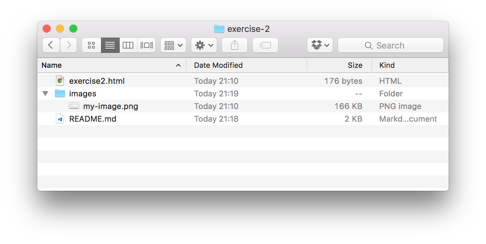

# Exercise 2: Anatomy of a web page

This exercise will get you started learning the anatomy of a web page with the help of Chrome DevTools.

You will learn how to:
 1. Write some basic HTML and insert an image into the page
 1. Use the _Elements_ panel in Chrome DevTools
 1. Create a separate file to contain your JavaScript code
 1. Use the _Network_ panel in Chrome DevTools


## 1. Writing some basic HTML

### What is HTML?
 > HTML is a **markup language**. HTML separates "content" (words, images, audio, video, and so on) from "presentation" (instructions for displaying each type of content). HTML uses a pre-defined set of elements to define content types. Elements contain one or more "tags" that contain or express content. Tags are enclosed by angle brackets, and the closing tag begins with a forward slash. (developer.mozilla.org)

 Basic HTML structure:

 ```html
 <!DOCTYPE html>
 <html>
   <head>
     <title>Title of my page</title>
   </head>
   <body>
     Some text
   </body>
 </html>
 ```

### Adding a heading and a paragraph
* Open `exercise2.html` in Chrome and in your code editor.
* Locate the empty `<body>`-tag. This is where we will be adding some markup.
* To create a main heading for the page, add a `<h1>`-tag with the text "This is my heading" inside the `<body>` tag.
* Next we will add a paragraph of text under the heading. Add a `<p>`-tag with the text "This is my paragraph" underneath the previous `<h1>`-tag.
* Refresh the page in the browser. The result should look something like this:

  

### Adding an image

* Download an image of your choice (GIF/PNG/JPG) and rename the file something more sensible.
* Create a sub folder called `images` inside the folder containing `exercise2.html`
* Move your image file into the `images` folder. The resulting folder structure should look like this:
  
* To display the image in the web page, we need to add an `` tag. The img tag does not have a closing tag. **Note the `/` at the end of the tag**:
```html

```
* If you refresh the browser, no image will be displayed yet. We need to set the `src` attribute to the relative path of the image in the `images` folder on your computer:
```html

```
* The `alt` attribute ("Alternate text") is used to specify a descriptive text that should be displayed if the image cannot be loaded. It is also important for accessibility (screen readers).
* Refresh the page. The result should be something like this:


> **Note:** Having trouble displaying the image? Double that the the path to the file in the `src` attribute is correct. Also verify that the syntax of the `` tag is correct. Still not working? Open the _Console_ panel in Chrome DevTools like in Exercise 1 to debug.
## 2. Chrome DevTools &ndash; The _Elements_ panel

## 3. Creating and loading an external `.js` file

## 4. Chrome DevTools &ndash; The _Network_ panel
